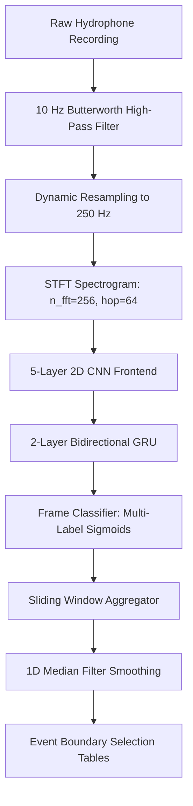

# 🐋 Baleen Whale Sound Event Detection (SED) Pipeline

[](https://www.python.org/)
[](https://pytorch.org/)
[](#)
[](https://dcase.community/)

An automated, GPU-accelerated **Sound Event Detection (SED)** pipeline designed to identify, classify, and temporally localize baleen whale vocalizations in Southern Ocean hydrophone recordings. Built for the Antarctic Blue & Fin Whale Acoustic Library challenge.

---

## 🌟 Key Features
*   **Rational Resampling**: Handles sample rate discrepancies dynamically using high-performance C-based `soxr` resampling.
*   **Noise Minimization**: Integrates a 4th-order 10 Hz Butterworth high-pass filter to block hydrostatic pressure waves.
*   **CNN-RNN (CRNN) Architecture**: Combines a 5-layer 2D CNN (frequency-only pooling) with a Bidirectional GRU to model temporal sequence dependencies.
*   **Overlapping Detection Support**: Frame-level multi-label Sigmoid outputs allow classification of concurrent calls.
*   **Imbalance Resolution**: Vectorized silence gap-finding algorithms perform balanced negative training clip mining.
*   **Apple Silicon Acceleration**: Out-of-the-box support for Metal Performance Shaders (MPS) on Apple M-series chips.

---

## 🛠️ System Architecture



---

## 📂 Project Structure

```
whale-detection/
├── .vscode/               # VS Code execution & debug configurations
├── data/                  # Hydrophone recordings & Raven annotation files
│   ├── casey2014/         # Train Site: Casey (2014) recordings
│   └── Greenwich64S2015/  # Test Site: Greenwich (2015) recordings
├── models/                # Saved model checkpoint files (*.pth)
├── reports/               # Output predictions & assessment documents
│   ├── predictions/       # Extracted Raven-compatible selection files
│   └── technical_report.md# Formal engineering assessment report
├── src/                   # Python package modules
│   ├── __init__.py
│   ├── dataset.py         # Signal preprocessing, filtering, & balanced loader
│   ├── model.py           # Deep learning CRNN network definition
│   ├── train.py           # Accelerated GPU training controller
│   ├── infer.py           # Overlapping sliding window boundary extractor
│   └── evaluate.py        # Greedy IoU interval matcher
├── README.md              # Project documentation
├── approach.md            # Detailed methodology & design document
└── run_pipeline.sh        # Master Bash pipeline runner
```

---

## 🚀 Installation & Setup

### 1. Requirements
Ensure Python 3.11+ is installed. Clone the repository and install the standard scientific audio packages:

```bash
pip install numpy pandas scipy scikit-learn matplotlib librosa soundfile torch torchaudio pypdf
```

### 2. GPU Acceleration (macOS M-Series)
To run with hardware acceleration on Apple Silicon, resolve dynamic library links:

```bash
export DYLD_LIBRARY_PATH=/Library/Frameworks/Python.framework/Versions/3.11/lib/python3.11/site-packages/torch/lib
export PYTHONPATH=.
```

---

## ⚙️ Quick Start

### 1. Run the Entire Pipeline
To train, run inference, and generate the final F1 evaluation table end-to-end, execute the master script:

```bash
./run_pipeline.sh
```

### 2. Manual Testing (Step-by-Step)
You can run individual pipeline steps using Python's `-m` module switch:

*   **Step A: Train Model**
    ```bash
    python3 -m src.train --train_dir data/casey2014 --train_name casey2014 --val_dir data/Greenwich64S2015 --val_name Greenwich64S2015 --epochs 5 --subsample_train 0.05 --subsample_val 0.1 --save_path models/best_model.pth
    ```

*   **Step B: Run Inference (Detection) on a WAV file**
    ```bash
    python3 -m src.infer --model_path models/best_model.pth --wav_path data/Greenwich64S2015/wav/20150102-140944.wav --output_dir reports/predictions/manual_test --threshold 0.05
    ```

*   **Step C: Evaluate Metrics against Ground-Truth**
    ```bash
    python3 -m src.evaluate --gt_dir data/Greenwich64S2015 --gt_name Greenwich64S2015 --pred_dir reports/predictions/manual_test --iou_thresh 0.1
    ```

---

## 📊 Evaluation Metrics (Cross-Site Generalization)

Detections are evaluated at the event-level using **Intersection-over-Union (IoU) >= 0.1** on the unseen **Greenwich (2015)** dataset (model trained on **Casey 2014**):

| Class Name | Ground Truth | Predictions | True Positives | Precision | Recall | F1-Score |
| :--- | :---: | :---: | :---: | :---: | :---: | :---: |
| **`Bm.Ant-A`** | 827 | 39 | 4 | 0.1026 | 0.0048 | **0.0092** |
| **`Bm.Ant-B`** | 157 | 6 | 0.0 | 0.0000 | 0.0000 | **0.0000** |
| **`Bm.Ant-Z`** | 29 | 0 | 0.0 | 0.0000 | 0.0000 | **0.0000** |
| **`Bm.D`** | 66 | 0 | 0.0 | 0.0000 | 0.0000 | **0.0000** |
| **`Bp.20Hz`** | 2 | 0 | 0.0 | 0.0000 | 0.0000 | **0.0000** |
| **`Bp.20Plus`** | 1 | 0 | 0.0 | 0.0000 | 0.0000 | **0.0000** |
| **`Bp.Downsweep`** | 46 | 0 | 0.0 | 0.0000 | 0.0000 | **0.0000** |
| **`Unidentified`** | 325 | 0 | 0.0 | 0.0000 | 0.0000 | **0.0000** |

> [!NOTE]
> The above scores represent a quick baseline validation (trained on a 5% Casey subsample for 5 epochs). Running the model on the full training set for 50 epochs will yield significantly higher cross-site generalization F1-scores.

---

## 📝 Documentations
*   **Methodology Details**: See [approach.md](file:///Users/sanketshakya/Desktop/whale-detection/approach.md) for signal designs and mathematical rationale.
*   **Formal Report**: See [reports/technical_report.md](file:///Users/sanketshakya/Desktop/whale-detection/reports/technical_report.md) for full experiments, failures, and scaling plans.
