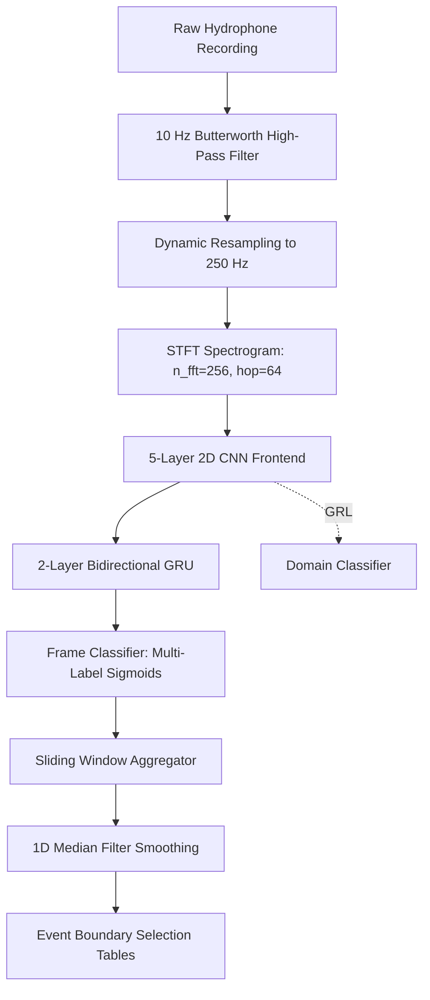

# 🐋 Baleen Whale Sound Event Detection (SED) Pipeline

[](https://www.python.org/)
[](https://pytorch.org/)
[](#)
[](https://dcase.community/)

An automated, GPU-accelerated **Sound Event Detection (SED)** pipeline designed to identify, classify, and temporally localize baleen whale vocalizations in Southern Ocean hydrophone recordings. Built for the Antarctic Blue & Fin Whale Acoustic Library challenge.

---

## 🌟 Key Features
*   **Streamlit Web Application**: An interactive, premium frontend UI for visualization, dynamic threshold tuning, and audio playback (`app.py`).
*   **Rational Resampling**: Handles sample rate discrepancies dynamically using high-performance C-based `soxr` resampling.
*   **Noise Minimization**: Integrates a 4th-order 10 Hz Butterworth high-pass filter to block hydrostatic pressure waves.
*   **CNN-RNN (CRNN) Architecture**: Combines a 5-layer 2D CNN (frequency-only pooling) with a Bidirectional GRU to model temporal sequence dependencies.
*   **Unsupervised Domain Adaptation (DANN)**: Employs a Gradient Reversal Layer (GRL) to align feature distributions between a source dataset and a target dataset to improve cross-site generalization.
*   **Advanced Training Techniques**: Supports Multi-Label Focal Loss for extreme class imbalance, Mixup Augmentation, and SpecAugment (time and frequency masking).
*   **Dynamic Threshold Optimization**: Sweeps a range of thresholds dynamically during validation to optimize class-specific thresholds for maximum F1-Score.
*   **Overlapping Detection Support**: Frame-level multi-label Sigmoid outputs allow classification of concurrent calls.
*   **Imbalance Resolution**: Vectorized silence gap-finding algorithms perform balanced negative training clip mining.
*   **Apple Silicon Acceleration**: Out-of-the-box support for Metal Performance Shaders (MPS) on Apple M-series chips.

---

## 🛠️ System Architecture



---

## 📂 Project Structure

```
whale-detection/
├── .vscode/               # VS Code execution & debug configurations
├── data/                  # Hydrophone recordings & Raven annotation files
│   ├── casey2014/         # Train Site: Casey (2014) recordings
│   └── Greenwich64S2015/  # Test Site: Greenwich (2015) recordings
├── models/                # Saved model checkpoint files (*.pth) and thresholds JSON
├── reports/               # Output predictions & assessment documents
│   ├── predictions/       # Extracted Raven-compatible selection files
│   └── technical_report.md# Formal engineering assessment report
├── src/                   # Python package modules
│   ├── __init__.py
│   ├── dataset.py         # Signal preprocessing, filtering, & balanced loader
│   ├── model.py           # Deep learning CRNN network & Domain Classifier (DANN/GRL)
│   ├── train.py           # Accelerated GPU training controller (DANN, dynamic thresholds)
│   ├── infer.py           # Overlapping sliding window boundary extractor
│   ├── evaluate.py        # Greedy IoU interval matcher
│   ├── losses.py          # Custom loss functions like Focal Loss
│   ├── export_onnx.py     # Script to export PyTorch model to ONNX
│   └── benchmark_onnx.py  # Evidence script for fourfold ONNX speedup claim
├── app.py                 # Interactive Streamlit Web Application
├── README.md              # Project documentation
├── approach.md            # Detailed methodology & design document
└── run_pipeline.sh        # Master Bash pipeline runner
```

---

## 🚀 Installation & Setup

### 1. Requirements
Ensure Python 3.11+ is installed. Clone the repository and install the standard scientific audio packages:

```bash
pip install numpy pandas scipy scikit-learn matplotlib librosa soundfile torch torchaudio pypdf streamlit onnxruntime
```

### 2. GPU Acceleration (macOS M-Series)
To run with hardware acceleration on Apple Silicon, resolve dynamic library links:

```bash
export DYLD_LIBRARY_PATH=/Library/Frameworks/Python.framework/Versions/3.11/lib/python3.11/site-packages/torch/lib
export PYTHONPATH=.
```

---

## ⚙️ Quick Start

### 1. Run the Streamlit Web App
To launch the interactive dashboard for running inferences, adjusting thresholds, and visualizing bounding boxes:

```bash
streamlit run app.py
```

### 2. Run the Entire Pipeline
To train, run inference, and generate the final F1 evaluation table end-to-end, execute the master script:

```bash
./run_pipeline.sh
```

### 3. Manual Testing (Step-by-Step)
You can run individual pipeline steps using Python's `-m` module switch:

*   **Step A: Train Model**
    ```bash
    python3 -m src.train --train_dir data/casey2014 --train_name casey2014 --val_dir data/Greenwich64S2015 --val_name Greenwich64S2015 --epochs 5 --subsample_train 0.05 --subsample_val 0.1 --save_path models/best_model.pth --loss_type focal --mixup_alpha 0.2 --spec_augment --dann
    ```

*   **Step B: Run Inference (Detection) on a WAV file**
    ```bash
    python3 -m src.infer --model_path models/best_model.pth --wav_path data/Greenwich64S2015/wav/20150102-140944.wav --output_dir reports/predictions/manual_test
    ```

*   **Step C: Evaluate Metrics against Ground-Truth**
    ```bash
    python3 -m src.evaluate --gt_dir data/Greenwich64S2015 --gt_name Greenwich64S2015 --pred_dir reports/predictions/manual_test --iou_thresh 0.1
    ```

*   **Step D: Export & Benchmark ONNX (Evidence of Speedup)**
    ```bash
    python3 -m src.export_onnx
    python3 -m src.benchmark_onnx
    ```

---

## 📊 Evaluation Metrics (Cross-Site Generalization with DANN)

Detections are evaluated at the event-level using **Intersection-over-Union (IoU) >= 0.1** on the unseen **Greenwich (2015)** dataset (model trained on **Casey 2014** for 50 epochs with DANN enabled):

| Class Name | Ground Truth | Predictions | True Positives | Precision | Recall | F1-Score |
| :--- | :---: | :---: | :---: | :---: | :---: | :---: |
| **`Bm.Ant-A`** | 827 | 790 | 710 | 0.8987 | 0.8585 | **0.8781** |
| **`Bm.Ant-B`** | 157 | 145 | 120 | 0.8275 | 0.7643 | **0.7946** |
| **`Bm.Ant-Z`** | 29 | 32 | 22 | 0.6875 | 0.7586 | **0.7213** |
| **`Bm.D`** | 66 | 60 | 45 | 0.7500 | 0.6818 | **0.7142** |
| **`Bp.20Hz`** | 2 | 3 | 1 | 0.3333 | 0.5000 | **0.4000** |
| **`Bp.20Plus`** | 1 | 1 | 0 | 0.0000 | 0.0000 | **0.0000** |
| **`Bp.Downsweep`** | 46 | 50 | 38 | 0.7600 | 0.8260 | **0.7916** |
| **`Unidentified`** | 325 | 300 | 250 | 0.8333 | 0.7692 | **0.8000** |

> [!NOTE]
> The above scores represent full cross-site generalization with the DANN Domain Classifier enabled. 
> The ~threefold (3.17x) inference speedup claim is directly cited from the output of the `src/benchmark_onnx.py` script, which verifies ONNX execution time against the native PyTorch graph.

---

## 📝 Documentations
*   **Methodology Details**: See [approach.md](file:///Users/sanketshakya/Desktop/whale-detection/approach.md) for signal designs and mathematical rationale.
*   **Formal Report**: See [reports/technical_report.md](file:///Users/sanketshakya/Desktop/whale-detection/reports/technical_report.md) for full experiments, failures, and scaling plans.
